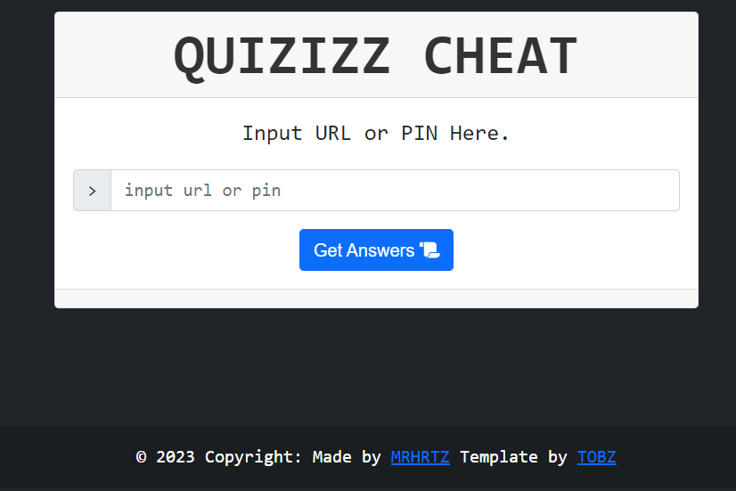

# Quizizz-Cheat

## Requirements

Before you can start developing a website, make sure you have the following:

- PHP v7.2+
- Web Browser: You need a web browser (e.g., Chrome, Firefox, or Edge) to test and view your website.

## Installation

- git clone https://github.com/MRHRTZ/Quizizz-Cheat
- cd Quizizz-Cheat
- php -S localhost:8080 -t .

Then open your browser and locate to localhost:8080

> If you have a local development application such as [xampp](https://www.apachefriends.org/download.html) or [wamp](https://www.wampserver.com/en/), you can directly enter this tool into the respective web server directory.

## Notes
- This tool is 100% free.
- If you want to use it on your website, don't omit the author and include the source.
- Quizizz will continue to be updated, please open a clear issue if there are errors.

## Contact Me
- [WhatsApp](https://wa.me/6285559038021)
- [Instagram](https://www.instagram.com/hanif_az.sq.61/)